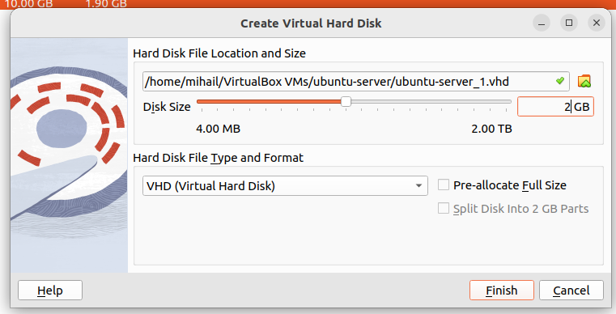

## Задание 2. LVM Management.

### Добавление к своей виртуальной машине диска /dev/sdb размером 2GB.

С помощью VirtualBox к виртуальной машине был добавлен диск на 2 ГБ:



Убедимся в этом:

```shell
lsblk | grep sdb
```

Вывод команды:

```
sdb      8:16   0 2G  0 disk 
```

### Создание раздела на /dev/sdb, используя parted.

Создадим раздел последовательно выполнив следующие команды:

```shell
parted -s /dev/sdb mklabel gpt
parted -s /dev/sdb mkpart primary 1MiB 100%
parted -s /dev/sdb set 1 lvm on
partprobe /dev/sdb
```

Здесь мы

* размечаем диск
* создаем раздел
* включаем LVM
* обновляем информацию о разделах

### Создание Physical Volume (PV) на разделе.

Для выполнения задачи выполним команду:

```shell
pvcreate /dev/sdb1
```

Вывод команды сообщает, что все создалось успешно:

```
Physical volume "/dev/sdb1" successfully created.
```

### Создание Volume Group (VG).

Для выполнения задачи выполним команду:

```shell
vgcreate vg_highload /dev/sdb1
```

Вывод команды сообщает, что все создалось успешно:

```
Volume group "vg_highload" successfully created
```

### Создание двух Logical Volume

Для выполнения задачи выполним команды:

```shell
lvcreate -L 1200MiB -n data_lv vg_highload && lvcreate -l 100% -n logs_lv vg_highload
```

Вывод команды сообщает, что все создалось успешно:

```
Logical volume "data_lv" created.
Logical volume "logs_lv" created.
```

### Форматирование data_lv как ext4 и его монтирование в /mnt/app_data.

Для выполнения задачи выполним команду:

```shell
mkfs.ext4 /dev/vg_highload/data_lv
```

Вывод команды сообщает, что все отформатировалось успешно:

```
mke2fs 1.47.0 (5-Feb-2023)
Creating filesystem with 307200 4k blocks and 76800 inodes.
UUID файловой системы: bf8f3640-7eea-46a1-bbd9-62aa96b6ee17
Superblock backups stored on blocks: 
    32 749, 98199, 163437, 229741, 294590
Распределение групповых таблиц: готово
Сохранение таблицы inod'ов: готово
Создание журнала (8192 блоков): готово
Writing superblocks and filesystem accounting information: готово
```

Создадим необходимую директорию и примонтируем туда вольюмы:

```shell
mkdir -p /mnt/app_data
mount /dev/vg_highload/data_lv /mnt/app_data
```

### Форматирование logs_lv как xfs и его монтирование в /mnt/app_logs.

Проделаем команды, подобные предыдущему пункту:

Форматируем:

```shell
mkfs.xfs /dev/vg_highload/logs_lv
```

Монтируем:

```shell
mkdir -p /mnt/app_logs
mount /dev/vg_highload/logs_lv /mnt/app_logs
```

Теперь проверим, что все смонтировалось с помощью утилиты `df`:

```shell
df -h | grep /mnt/app_
```

Вывод команды:

```
/dev/mapper/vg_highload-data_lv 1,2G  24K  1,1G   1% /mnt/app_data
/dev/mapper/vg_highload-logs_lv 780M  48M  733M   7% /mnt/app_logs
```
