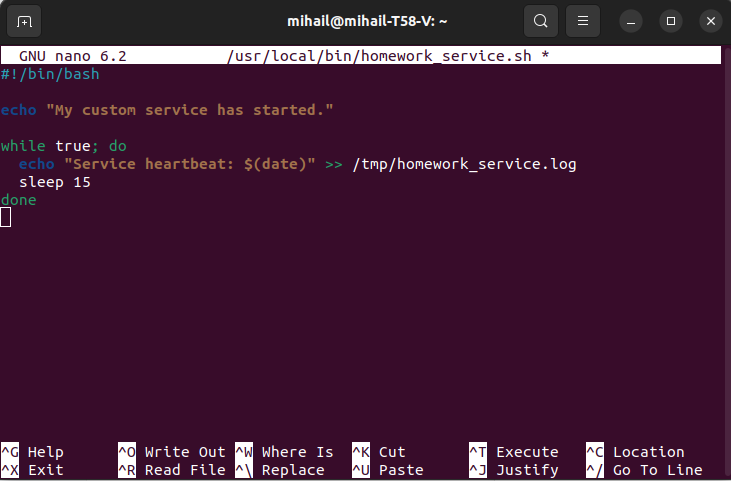
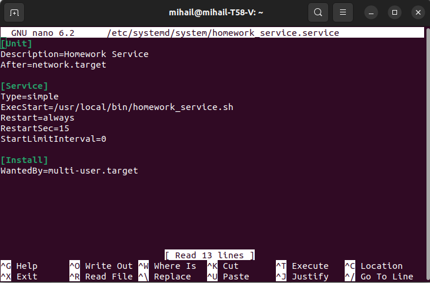

## Задание 1. Systemd.

### Создание bash-скрипта



Сохраним и сделаем файл исполняемым:

```shell
sudo chmod +x /usr/local/bin/homework_service.sh
```

Создадим service-файл, чтобы `systemd` мог управлять скриптом:



Политика `Restart=always` говорит о том что при падении скрипт снова запустится. `RestartSec=15` - обозначает время до рестарта.

Теперь применим изменения. Для этого необходимо перезапустить `systemd`, выполнить `enable` (для активации сервиса с нашим скриптом) и `start` для его запуска.

```shell
sudo systemctl daemon-reload
sudo systemctl enable homework_service.service
sudo systemctl start homework_service.service
```

Проверим статус и логи, чтобы убедиться, что все работает:

```shell
sudo systemctl status homework_service.service
```

Вывод:

```
● homework_service.service - Homework Service
     Loaded: loaded (/etc/systemd/system/homework_service.service; enabled; vendor preset: enabled)
     Active: active (running) since Sun 2025-10-12 16:06:20 MSK; 1min 8s ago
   Main PID: 10235 (homework_servic)
      Tasks: 2 (limit: 18827)
     Memory: 644.0K
        CPU: 8ms
     CGroup: /system.slice/homework_service.service
             ├─10235 /bin/bash /usr/local/bin/homework_service.sh
             └─10287 sleep 15

окт 12 16:06:20 mihail-T58-V systemd[1]: Started Homework Service.
окт 12 16:06:20 mihail-T58-V homework_service.sh[10235]: My custom service has started.
```

```shell
tail -f /tmp/homework_service.log
```

``` 
Service heartbeat: Вс 12 окт 2025 16:06:50 MSK
Service heartbeat: Вс 12 окт 2025 16:07:05 MSK
Service heartbeat: Вс 12 окт 2025 16:07:20 MSK
Service heartbeat: Вс 12 окт 2025 16:07:35 MSK
Service heartbeat: Вс 12 окт 2025 16:07:50 MSK
Service heartbeat: Вс 12 окт 2025 16:08:05 MSK
Service heartbeat: Вс 12 окт 2025 16:08:20 MSK
Service heartbeat: Вс 12 окт 2025 16:08:35 MSK
Service heartbeat: Вс 12 окт 2025 16:08:50 MSK
Service heartbeat: Вс 12 окт 2025 16:09:05 MSK
Service heartbeat: Вс 12 окт 2025 16:09:20 MSK
Service heartbeat: Вс 12 окт 2025 16:09:35 MSK
Service heartbeat: Вс 12 окт 2025 16:09:50 MSK
```

### Вывод топ-5 сервисов с самым медленным стартом

Для того чтобы выполнить задачу, необходимо ввести следующую команду:

```shell
systemd-analyze blame | head -5
```

Вывод команды:

```
6.368s NetworkManager-wait-online.service
6.299s plymouth-quit-wait.service
2.531s fwupd-refresh.service
2.272s postgresql@14-main.service
1.928s snapd.seeded.service
```